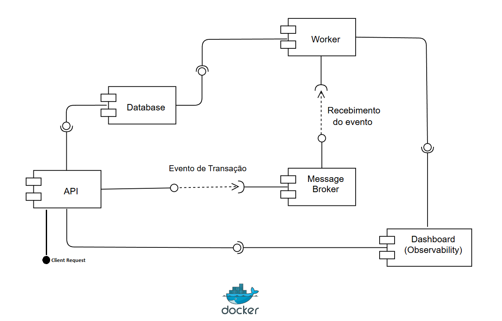
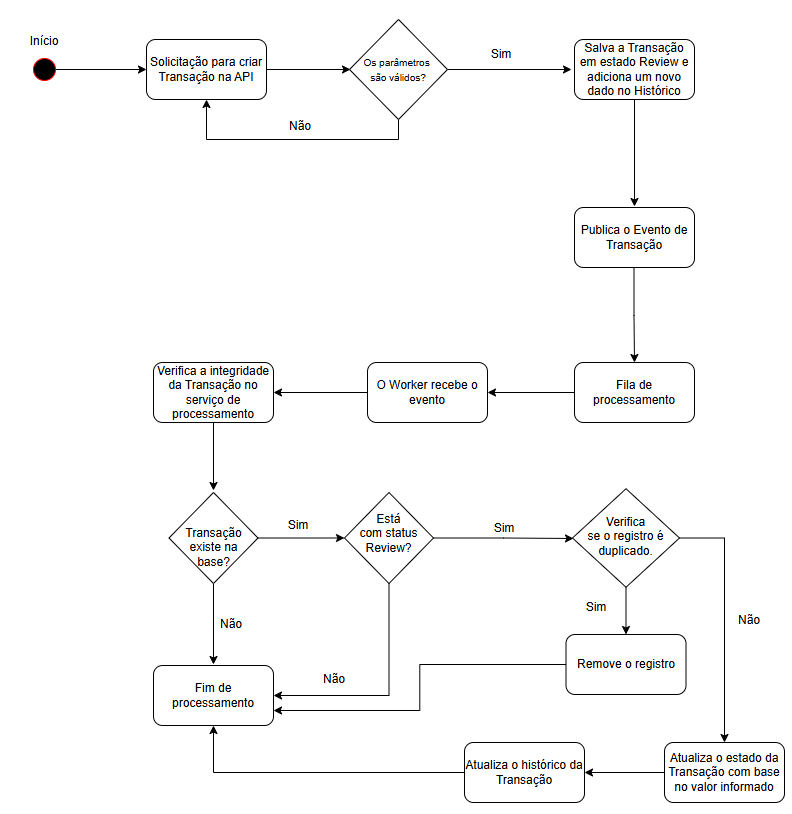

# Netrin-antifraude

Projeto criado para implementar módulo de avaliação antifraude

## Descrição

A **NetrinAF API** é uma API REST para gerenciamento de transação do sistema.

Ela permite:

- cadastrar uma transação;
- consultar a transação por Id;

O **NetrinAF Worker** é uma serviço que recebe transações via mensageria para realizar uma avaliação de antifraude.

As aplicações citadas utilizam .NET 10, Entity Framework Core, Polly para resiliência, FluentValidation, Mensageria via RabbitMq e banco de dados via SQL Server.
Podendo ser executada via Docker.

> Atualmente, a API e o worker utilizam uma opção de observabilidade via **OpenTelemetry** conectado a um dashboard do `Aspire`. Os dados são descartados quando essa aplicação é encerrada.

## Componentes

### Diagrama

O diagrama abaixo mostra a interação dos componentes do sistema:



## Architecture Decision Records

Os seguintes documentos de ADR foram anexados ao projeto:

| ADR | Title | Status |
|------|-------|--------|
| ADR-001 | Implementação do Rabbitmq | Accepted |
| ADR-002 | Adoção do SQL como banco de dados | Accepted |
| ADR-003 | Implementação de Idempotência | Accepted |

Estão localizados em:

docs/
├── ADR-001-Rabbitmq.md
├── ADR-002-Sqlserver.md
├── ADR-003-Idempotencia.md

## Arquitetura

Ambos os projetos segue os princípios de **Clean Architecture**, separando responsabilidades em camadas:
- **NetrinAF API** - 
```text
src/antifraude/
├── Domain/
│   └── NetrinAF.Domain
├── Application/
│   └── NetrinAF.Application
├── Infrastructure/
│   └── NetrinAF.Infra.SQLDatabase
│   └── NetrinAF.Infra.Bus
├── Api/
│   └── NetrinAF.Api
└── Tests/
    └── NetrinAF.Test
```
- **NetrinAF Worker** -
```text
src/worker/
├── Domain/
│   └── NetrinAF.Worker.Domain
├── Application/
│   └── NetrinAF.Worker.Application
├── Infrastructure/
│   └── NetrinAF.Worker.Infra.SQLDatabase
│   └── NetrinAF.Worker.Infra.Bus
├── AppHost/
│   └── NetrinAF.Worker.AppHost
└── Tests/
    └── NetrinAF.Worker.Test
```

### Domain

Contém as regras e os modelos centrais do negócio:

- entidades;
- objetos de valor;
- enums;
- contratos dos repositórios;
- eventos;

### Application

Coordena os casos de uso da aplicação:

- commands e queries;
- implementação handlers e serviços;
- validadores;
- middleware;
- abstrações de dados de entrada e saída.

### Infrastructure

Implementa os contratos definidos pelo domínio:

- contexto do Entity Framework Core;
- repositórios;
- persistência;
- Unit of Work.

### Api e AppHost

Aplicações responsável por rodar os seus respectivos projetos, contendo:

- versionamento;
- Swagger (Apenas Api);
- configuração da aplicação.

### Test

Contém testes unitários com:

- xUnit;
- Moq;
- Builder Pattern para criação dos objetos utilizados nos testes.

## Endpoints de Health Check 

**NetrinAF API**
```text
http://localhost:7144/netrin-af/health-check
```
**NetrinAF Worker**
```text
http://localhost:7115/netrin-af-worker/health-check
```

## Executar todo o ecossistema com Docker Compose

O Compose inicializa RabbitMQ, SQL Server, Aspire Dashboard, API e Worker. O
serviço `migrations` aguarda o SQL Server, cria o banco `Netrin` quando ele ainda
não existe e aplica somente as migrations pendentes antes de iniciar a API e o
Worker.

```bash
docker compose up --build
```

Serviços expostos localmente:

- API: `http://localhost:7144`
- Worker health check: `http://localhost:7115/netrin-af-worker/health-check`
- RabbitMQ Management: `http://localhost:15672` (admin / admin123)
- Aspire Dashboard: `http://localhost:18888`
- SQL Server: `localhost,1433` (sa / mtmu53r!)

Para recriar o SQL Server do zero, remova apenas o volume persistente e suba a
stack novamente; o serviço de migrations recriará¡ o banco e o schema:

```bash
docker compose down
docker volume rm netrin-af_sqlserver-data
docker compose up --build
```

## IdempotencyKey 

Cada requisição é processada pelo middleware que recebe um identificador de Idempotência no header:

```http
X-Idempotency-Key: {string}
```

O cliente pode enviar esse header. Caso ele não seja informado em uma ação que seja do tipo POST, a API gera um erro de processamento.

O mesmo valor é:

- adicionado ao header da resposta;
- incluído no banco de dados como dado adicional ao registro de transação;
- utilizado para relacionar dados de requisições que serão persistidos em sistemas distribuidos.

### Observabilidade com OpenTelemetry e Aspire

A API e o Worker exportam traces, métricas e logs por OTLP/gRPC:

Dentro da rede Docker, o endpoint utilizado pela API é:

```text
http://localhost:4317
```

Com o aspire-dashboard rodando, para visualizar a telemetria:

1. acesse `http://localhost:18888/`;
2. Caso precise de um token para acessar, no powershell, digite `docker logs aspire-dashboard`;
3. Verifique o conteúdo na linha **Login URL**, como no exemplo abaixo;
```text
 Login URL:  http://localhost:18888/login?t=916229ec70b1a7ff50555ce5a0159434
```
4. Obtenha o valor do parâmetro `t` na url informada para ser usado no login do Aspire;
5. Ao logar terá acesso aos traces, logs e métricas.


## Workflow da Solução

### Diagrama do fluxo principal

O Diagrama do fluxo principal do sistema:



### 1. Persistir a transação em estado inicial e enviar o Evento de transação criada

A transação é enviada via endpoint do tipo POST, após validada é persistida com estado inicial de REVIEW junto com um registro no histórico da transação. Um evento é gerado no fim deste processo.

```http
POST /netrin-af/v1/transactions
Content-Type: application/json
X-Idempotency-Key: teste123
```

```json
{
  "value": 102.00
}
```

Regras para sucesso:

- `value` é obrigatório e maior que 0;

Status possíveis:

- `200 OK`: requisição criada, retorno com IdTransaction;
- `400 Bad Request`: dados inválidos;

Estratégia de resiliência via Polly para Retry (SQL Exception):

- Retry de 2 tentantivas 
- Delay de 2 segundos
- Backoff Exponencial (aumenta o delay por tentativa)
> Tipo de backoff escolhido para dar tempo ao serviço externo se recuperar.

Estratégia de Fallback:

- `400 Bad Request`: objeto vazio;

### 2. Recebimento do evento de transação 

O evento é recebido via RabbitMq, o serviço **NetrinAF Worker** fica responsável por capturar o evento, após o recebimento, o serviço de processamento de transação obtém o registro no SQL pelo IdEmpotency e aplicar as regras. Após aplicar as regras o registro é atualizado e um novo dado no histórico é inserido.

```TransactionCreatedEvent
{
  "TransactionId": {guid},
  "IdempotencyKey": {string},
  "correlationId": {string}
}
```

Regras para Aprovar:

- O estado registro obtido tem que estar no estado REVIEW;
- O `value` do registro tem que ser maior que 100.00

Estratégia para dedup:

- Caso haja transações duplicadas, elas serão excluidas do SQLServer.

Estratégia de resiliência via RabbitMq para Retry (Exception):

- Retry de 1 tentantivas 
- Delay de 60 segundos
> Caso o erro persista a mensagem fica armazenada na fila chamada de `transaction.dead-letter-queue`.

### 3. Consultar a transação

A transação pode ser consultada via endpoint GET /transactions passando o Id da transação como .

```http
GET /netrin-af/v1/transactions/{transactionId}
Content-Type: application/json
```

Regras para sucesso:

- `transactionId` precisa existir no Banco de Dados;

Status possíveis:

- `200 OK`: requisição criada;
- `404 Not Found`: dados inválidos;
- `500 InternalServerError`: mensagem de erro inesperado;
